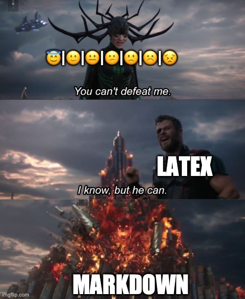
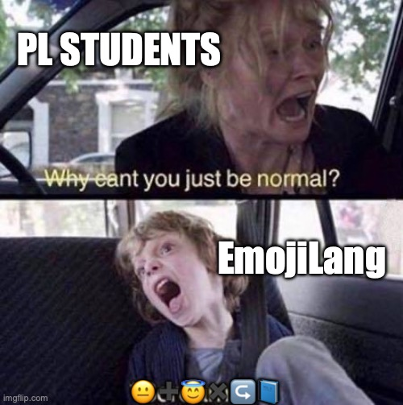
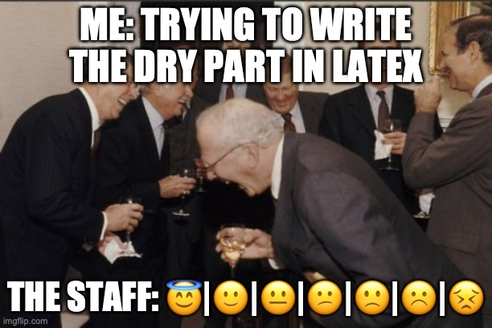

# 236319 - Programming Languages - HW02

Submitted by Itay Segev and Arad Reder

## Question 1
For convenience, we'll mark the rules as follows:
1. `<statements>` = `<statement>` `<statements>` | `<statement>`
2. `<statement>` = ✍️`<variable>`⬅️`<expression>`
3. `<statement>` = 📖`<expression>`
4. `<expression>` = ↪️`<variable>`
5. `<expression>` = `<term>`
6. `<expression>` = `<expression>` `<operation>` `<expression>`
7. `<variable>` = 📗|📘|📙|📕|📔
8. `<term>` = 😇|🙂|😐|😕|🙁|☹️|😣
9. `<operation>` = ➕|➖|✖️|➗

Where "1.1" refers to the first derivation of rule no. 1.

### 1.
Start Symbol: `<statements>`.  
Terminals: ✍️, ⬅️, 📖, ↪️, 📗, 📘, 📙, 📕, 📔, 😇, 🙂, 😐, 😕, 🙁, ☹️, 😣, ➕, ➖, ✖️, ➗.  
Non-Terminals: `<statements>`, `<statement>`, `<expression>`, `<variable>`, `<term>`, `<operation>`.

### 2.
#### a. No

Every `<statements>` starts with a `<statement>`, which, in turn, starts with either a ✍️ or 📖. This series of terminals doesn't begin with either, so it doesn't belong in this grammar.
#### b. No

Every notebook emoji comes from a variable, and every variable needs either a ↪️ or a ✍️ before it according to the grammer. On line 3 there's a notebook with a ⬅️ before it, which can't be in this grammer.

#### c. Yes

`<statements>`

&darr; 1.1

`<statement>`   `<statements>`

&darr;  
&darr; 1.1

`<statement>`   `<statement>`   `<statements>`

&darr;  
&darr;  
&darr; 1.2

`<statement>`   `<statement>`   `<statement>`

&darr; 2.1  
&darr; 3.1  
&darr; 2.1

✍️ `<variable>` ⬅️ `<expression>`  
📖 `<expression>`  
✍️ `<variable>` ⬅️ `<expression>`  

&darr; 7.4 5.1  
&darr; 6.1  
&darr; 7.1 6.1

✍️ 📕 ⬅️ `<term>`  
📖 `<expression>` `<operation>` `<expression>`  
✍️ 📗 ⬅️ `<expression>` `<operation>` `<expression>`  

&darr; 8.4  
&darr; 5.1 9.3 6.1  
&darr; 5.1 9.2 5.1

✍️ 📕 ⬅️ 😕  
📖 `<term>` ✖️ `<expression>` `<operation>` `<expression>`  
✍️ 📗 ⬅️ `<term>` ➖ `<term>`  

&darr;  
&darr; 8.7 4.1 9.2 5.1  
&darr; 8.2 8.2

✍️ 📕 ⬅️ 😕  
📖 😣 ✖️ ↪️ `<variable>` ➖ `<term>`  
✍️ 📗 ⬅️ 🙂 ➖ 🙂  

&darr;  
&darr; 7.4 8.1  
&darr;

✍️ 📕 ⬅️ 😕  
📖 😣 ✖️ ↪️ 📕 ➖ 😇  
✍️ 📗 ⬅️ 🙂 ➖ 🙂  

#### d. No
"😡" is not a terminal, and so any string that contains it does not belong in EmojiLang.

### 3. Yes
For example: "📖 🙂 ➕ 🙂 ➕ 🙂" is ambiguous. Because this can come to be in 2 different ways:

`<statements>`

&darr; 1.2

`<statement>` 

&darr; 3.1

📖 `<expression>`

&darr; 6.1

📖 `<expression>` `<operation>` `<expression>`

From here we can break either the left or right `<expression>` to "`<expression>` `<operation>` `<expression>`" (using 6.1), which will create 2 different trees (with possibly 2 different meanings).

## Question 2

1. The "`#`" function in SML casts a `string` to a `char`, but the "`^`" function expects 2 strings.
2. The "`/`" function expects 2 `real`s, but both 84 and 2 are `int`s.
3. Comparing `x` and `0` leads us to believe `x` is of type `int`, but the function can either return `x` or `false` (depending on the value of `x`), which is forbidden in SML since a function can only have a single return type (`x` is `int`, `false` is `bool`).
4. Comparing `x` and `#"a"` leads us to believe `x` is of type `char`, but further on we try to use `^` on it, which only accepts `string` types as arguments.
5. The `-` in SML means subtraction, not negation (negation is `~`), and so `(-3)` is not a valid expression.
6. The function `Math.sqrt` expects a `real` as an argument, but `9` is of type `int`.
7. `sin` is not a defined function in SML.
8. `if` is a reserved word in SML, and cannot be used as a value name.
9. The function `String.sub` returns the `char` at the specified index of a string. The index of the last character in `"hello"` is 4, and so trying to take the 5th character isn't allowed.
10. The `Math.sqrt` function's return type is `real`, although the function `sqrt_of_int` is set to return an `int`.

## Rejected Memes

